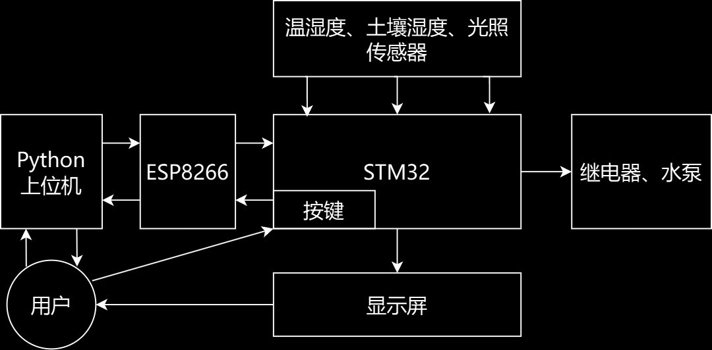
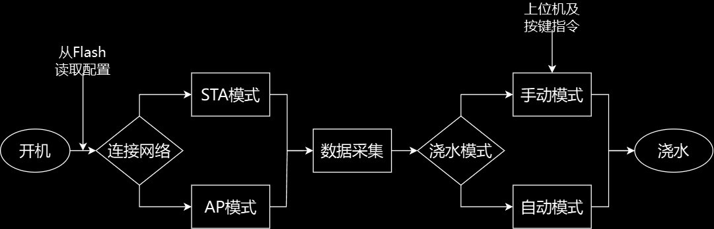
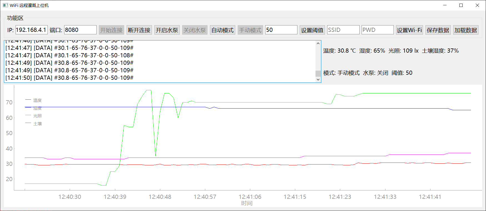
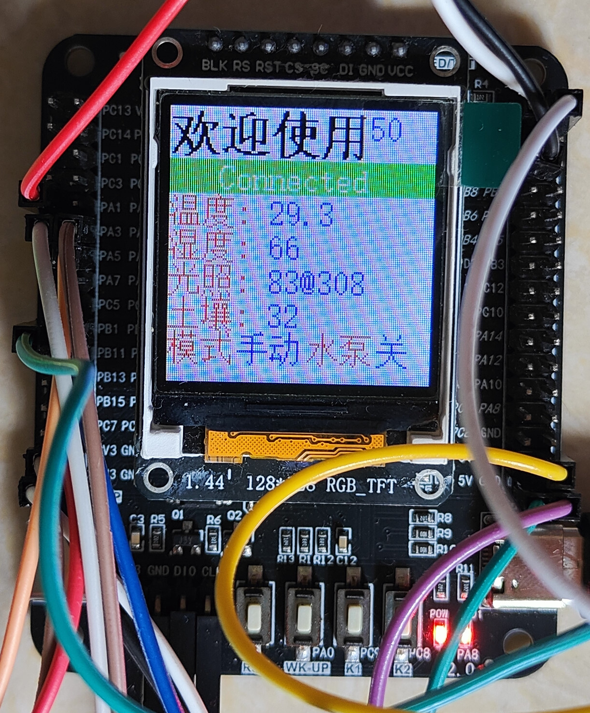

# 使用stm32f103rct6搭建的wifi远程灌溉小项目

## 1、整体结构

## 2、运行逻辑

## 3、主要使用的硬件以及接线方案

#### (1) 1.44寸SPI彩屏

BLK <-> PB4
DC <-> PB5
RES <-> PB6
CS <-> PB7
SCL <-> PB8
SDA <-> PB9

#### (2) DTH11温湿度传感器

AO <-> PB0

#### (3) GL5516光敏电阻传感器

AO <-> PA4

#### (4) YL-69土壤湿度传感器

AO <-> PA1

#### (5) ESP8266-01S

RX <-> PA2
TX <-> PA3

#### (6) 继电器，常开端连接水泵

IN <-> PB1

## 4、上位机

## 5、下位机

